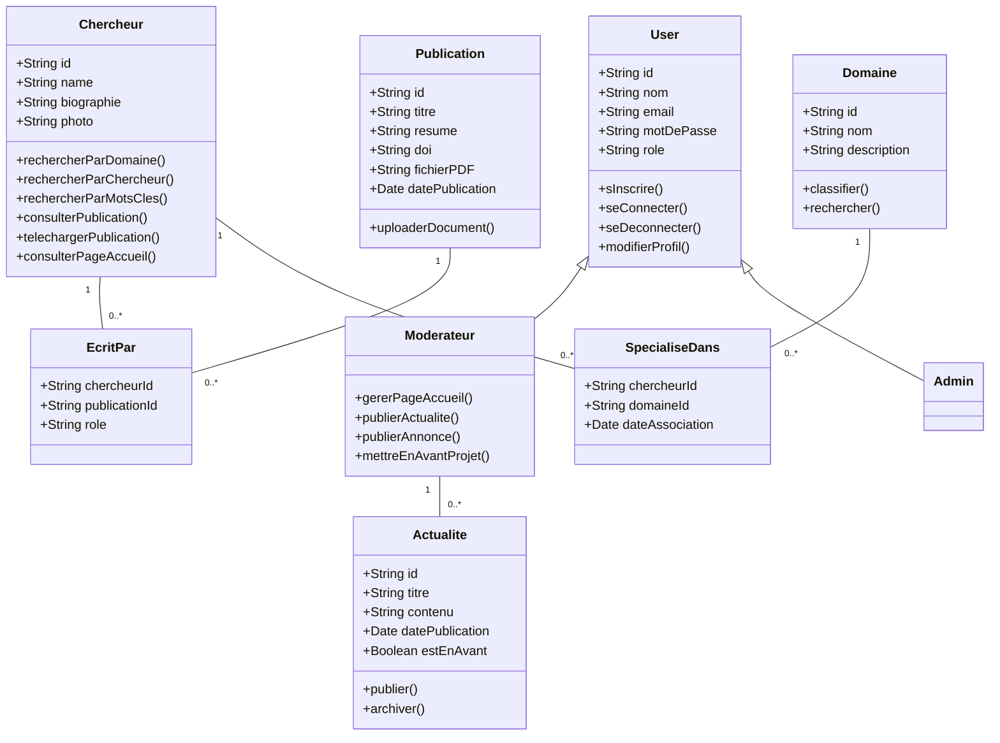

```mermaid

classDiagram
    class User {
        +String id
        +String nom
        +String email
        +String motDePasse
        +String role
        +sInscrire()
        +seConnecter()
        +seDeconnecter()
        +modifierProfil()
    }

    class Moderateur {
        +gererPageAccueil()
        +publierActualite()
        +publierAnnonce()
        +mettreEnAvantProjet()
    }

    class Chercheur {
        +String id
        +String name
        +String biographie
        +String photo
        +rechercherParDomaine()
        +rechercherParChercheur()
        +rechercherParMotsCles()
        +consulterPublication()
        +telechargerPublication()
        +consulterPageAccueil()
    }

    class Domaine {
        +String id
        +String nom
        +String description
        +classifier()
        +rechercher()
    }

    class Publication {
        +String id
        +String titre
        +String resume
        +String doi
        +String fichierPDF
        +Date datePublication
        +uploaderDocument()
    }

    class Actualite {
        +String id
        +String titre
        +String contenu
        +Date datePublication
        +Boolean estEnAvant
        +publier()
        +archiver()
    }

    class EcritPar {
        +String chercheurId
        +String publicationId
        +String role
    }

    class SpecialiseDans {
        +String chercheurId
        +String domaineId
        +Date dateAssociation
    }

    User <|-- Moderateur
    User <|-- Admin

    Moderateur "1" -- "0..*" Actualite 

    Chercheur "1" -- "0..*" EcritPar
    Publication "1" -- "0..*" EcritPar

    Chercheur "1" -- "0..*" SpecialiseDans
    Domaine "1" -- "0..*" SpecialiseDans
```
